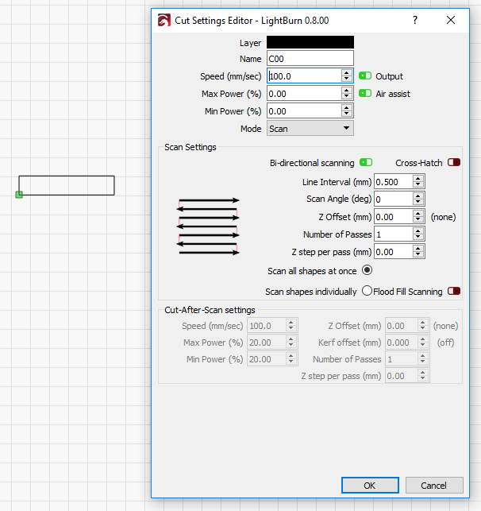
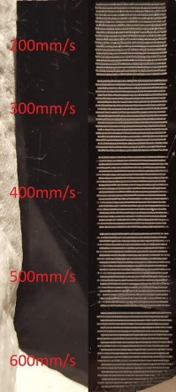

[Return to main page](README.md)

----

# Scanning Offset Adjustment

Modern lasers are capable of moving very fast, and with remarkable precision, however firing the beam still takes time.  Some power supplies and tubes may respond in less than a millisecond, but many take longer.

At 100 mm/second, 254 dots per inch means your dots are 0.1mm in length, fitting 1000 of them in 100mm. At 100 mm/sec, if your power supply and tube take 1 millisecond to fire, your engraving will be offset by a full dot width.

At 500 mm/second, that 1 millisecond delay means you'll be off by 5 dots, or 1/2 a millimeter. Still not very much, but visible. Many power supplies and tubes will take even longer to fire.

The result often looks like ghosted edges.  The image below is a 20mm square at 1000 mm/sec, with a 1ms delay, resulting in a full mm of skew between scans:

LightBurn has a setting to counter this, called Scanning Offset Adjustment, in the [Device Settings](DeviceSettings.md):

To use this feature, you need to measure the response of your machine at a couple of different speeds. Create a small rectangle in LightBurn, 50mm wide and 10mm high, set it to scan, and set the interval to 0.5mm.  If you are on a GCode based device, enable overscan, and set it to 5% or greater to be sure the machine is not slowing down before reaching the ends.  (Ruida devices overscan automatically).  Note that in the image below I have power set to 0 - Don't do this. You will need to set the power high enough to mark your material.

Run this rectangle at multiple speeds, like 100mm/sec, 200mm/sec, 300mm/sec, and so on. Depending on your hardware you may not even need to use these settings, however here is example output from a machine that does:

To compensate for this, measure the distance between the ends of the lines at each speed, and enter the speed and distance values into the scanning offset adjustment table.  LightBurn will use this information to compute the correct adjustments for other speeds as well.  A minimum of two measurements are needed for it to work.

There is an excellent tutorial online at Cartonus.com here: http://cartonus.com/how-to-improve-engraving-quality-of-laser-machine/

You may need to do this multiple times, making minor adjustments to get clean results at each speed.  After entering the measurements for the above speeds, the resulting corrected output looks like this:

# Line Wobble

A different, but equally common problem, is line wobble, often caused by too high an acceleration setting. When doing the test cuts above, you may notice lines that look like this:

If so, your machine is moving too quickly between the rows, and you're seeing physical "bounce" in the gantry because of it.  Lowering the acceleration setting for your Y axis can correct this.

