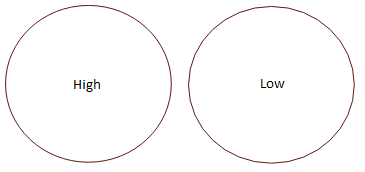

### [Return to main page](README.md)

This is the main LightBurn settings page.

There are a few different sections here, all related to different settings:

- [Display / Graphics](#Display_Graphics)
- [Grid / Units](#Grid_Units)
- [DXF Import Units](#DXF_Import_Units)
- [Output Settings](#Output_Settings)

## Display / Graphics

These settings affect only the visual display quality of LightBurn - changing these does not affect the generated output to your machine.

##### Curve Quality

This controls the level of precision that LightBurn outputs splines. If you look closely at the comparison below, you can see the right image is made of straight lines, about 1/8" (4mm) long. The left image is also made of line segments, just many more of them, so the effect is imperceptible. This extra quality comes with a slight cost in speed. You'll only likely notice it in files with thousands of curved shapes.

##### Anti-aliasing

Aliasing is commonly called "jaggies" - in our case, it's the visible appearance of pixels when drawing 2d shapes. Anti-aliasing draws shaded pixels on either side of the drawn lines to give the appearance of higher resolution and a smoother result. The image below compares the two - The difference is very apparent, however this comes with a moderate performance penalty. If you are running an older machine, turning off antialiasing may improve the interactivity of LightBurn on dense scenes.

##### Invert mouse wheel zoom direction

I'm a PC guy, with a Mac, and the scroll wheel always feels backwards to me, so this switch changes the direction you scroll when zooming. If you're a Mac person stuck on a PC, this is also for you.

## Grid & Units

##### Inches / mm

LightBurn currently operates in millimeters only. At some point after the initial release, we expect to support both metric (mm) and imperial (inch) units. For now, this setting is disabled.

##### Snap to Objects / Snap to Grid

LightBurn has two snapping behaviors which can be enabled / disabled here. Snap to Objects will snap your pointer location to the nearest object center or vertex when creating new objects, or drawing lines, making it easier to connect and align shapes.  Snap to Grid will snap your cursor position to the nearest grid location, as specified by the Grid Snap value.  Note that the Grid Snap and the Visual Grid do not have to be the same.

##### Click Selection Tolerance

This is how close you have to be to a line or vertex, in screen pixels, to click it.  Increase this number if you have trouble selecting things, decrease it if you find yourself selecting things you didn't mean to.

##### Object Snap Distance

Controls how close, in screen pixels, your cursor has to be to an object vertex or center to engage the object snapping behavior.

## DXF Import Units

If you work with DXF files, you may need to use this.  DXF files do not store the measurement system that was used to create them. If you create an object that is 5 inches wide, it might import as 5mm wide, because LightBurn can only see the '5'. Similarly, if your object was created in microns, it might import huge. Set this value as appropriate before importing DXF files to ensure correct scaling.

## Output Settings

These two settings affect the output sent to the laser.

##### Job Origin

This setting controls where LightBurn assumes your laser position to be relative to the graphics in your project when using a "Start From" value of "Current Position" or "User Origin".  This is explained in more detail in the Coordinates and Origin settings page.

##### Curve Tolerance

This setting is similar to the Curve Quality setting above, except that it controls the quality of output to the laser. The number is a measure of how much error to allow in the output.  A value of 0 would be "perfect", but would create very dense data, as some lasers can only process line segments.

In the above image, the blue curve between the two points is the ideal shape. The black line is a straight line between them, and the red line shows the error (how far the line is from the curve). LightBurn measures this error, and if it's equal to or lower than the Curve Tolerance value, it outputs the straight line. If not, the curve is subdivided into two linear segments and the process repeats with each new segment. Those segments are shown below in violet, along with their new error values.  You can see that the two new lines do a much better job of approximating the original curve.

Most people will probably never need to change this - the default is 0.05mm, which is about 1/2 the width of a typical beam.  Note that this is the *maximum* error value allowed, so typical output will be better than this, and this only affects curves, not straight lines or vertices, which are exact.