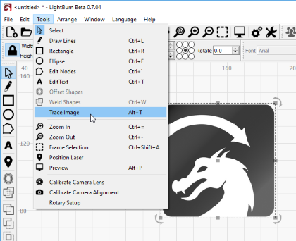
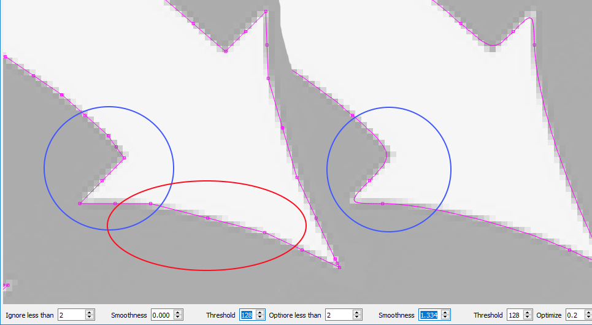

[Return to main page](README.md)

# Tracing Images

LightBurn has a feature that will trace the outline of a bitmap image and convert it to a vector graphic.  This works best for content that has very clear edges, like a silhouette or a cartoon.  It does not work very well for photographs, though with some cleanup those may be usable as well.

To start, import an image object into LightBurn, select it, then choose Tools -> Trace Image from the menu (or press Alt-T)

You'll be presented with the Trace Image dialog, with your image showing in the window, like this:

In the image above, the purple lines are the vectors that LightBurn has produced from the image being traced. If you want to be able to see them more clearly, click the "Fade Image" button, and the image will dim. You can also zoom and pan using the same controls as the preview window (mouse wheel to zoom, and click-drag the view with either left or middle mouse).

### Controls:

##### Ignore less than

This setting tells the vectorizer to ignore anything smaller than this many pixels in area. If you are trying to vectorize a noisy image, increasing this may help.

##### Smoothness

Bitmap images are made of pixels, and pixels are rectangles. Image tracing tries to infer shapes from these arrangements of rectangles, and has to smooth out the results or everything would just look like stairs. Part of the process is trying to recover smooth shapes from jagged lines, and this number controls how aggressive the smoothing is. A value of 1.333 is the maximum, and will make almost everything into curves. A value of 0.0 will produce all straight lines. The difference is shown below:

Notice in the left image, with a Smoothness of zero, the area highlighted in red is made of several line segments, whereas the same area in the right image is a continuous curve. The area shown in blue is also sharp in the left image, but with the Smoothness value set to maximum, the image at right shows how even sharp corners become smoothed, and this is rarely desired.  The default value of 1.0 is a good mix between producing smooth curves while still maintaining sharp corners.

##### Threshold

The Threshold value controls the brightness value used as the cutoff between "light" and "dark" pixels. In images with continuous shading, or images that are very light or dark, you may need to adjust this value to get the best result.

##### Optimize

After generating lines and curves, the image trace feature will attempt to merge similar lines and curves together to reduce the node count of the result. The Optimize parameter controls how aggressive this is. 0 means no merging. The default of 0.2 is a nice balance between accuracy of the result and node count.

##### Fade Image

Dims the image to make it easier to see the resulting vector shapes

##### Show Points

Enables the display of the points (nodes) of the resulting vector trace. Enabling this is useful when you are tuning the Optimize parameter to see the resulting points.